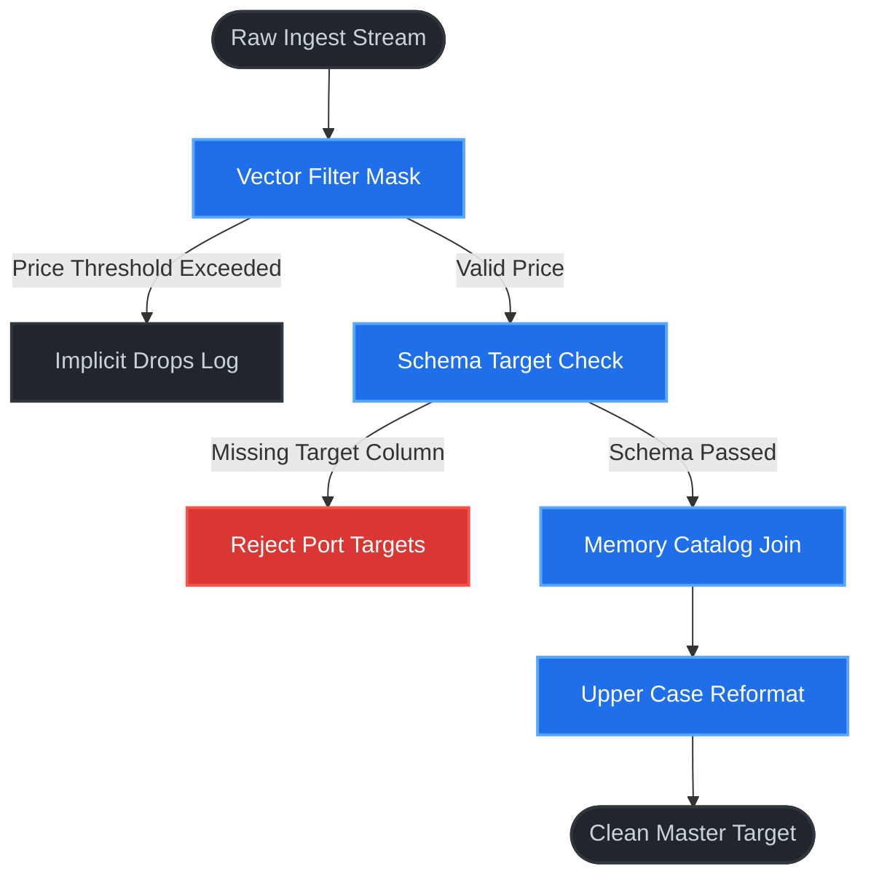

# ⚡ Open-GDE & Multi-Core Pipeline Engine
**Created by srinivasta**

A high-performance, single-file Streamlit application that emulates a traditional 3-Tier Enterprise ETL Architecture. It models the core mechanics of visual pipeline design, rapid catalog reference lookups, and hardware-optimized vectorized array transformations.

---

## 🏛️ Architecture Overview

The application splits data processing responsibilities across three distinct functional layers:

### 1. Layer 1: Graphical Development Environment (GDE UI)
* **Tech Stack**: Streamlit Dashboard Core
* **Function**: Serves as the orchestration plane. Engineers dynamically configure system inputs, tweak sliding price thresholds, and toggle structural schema validation rules.

### 2. Layer 2: Vectorized Co>Operating System Engine
* **Tech Stack**: Pandas Array Vectorization
* **Function**: Eliminates CPU multi-threading bottlenecks and slow Python processing loops. Uses native memory-layer array methods (`.map()`, `.str`) to filter records, execute structural reformats, and partition schema failures to error tracking targets.

### 3. Layer 3: EME Catalog & Lookup Files
* **Tech Stack**: In-Memory Dictionary Registry
* **Function**: Acts as the centralized reference store for business rules, tracking department mappings and managerial ownership metadata used during the transformation cycle.

---

## ⚙️ Core Pipeline Logic



---

## 🚀 Quick Start

### 📋 Prerequisites
Ensure your local Python runtime matches the requirements:
* Python 3.8+
* `pip` package manager

### 🔧 Installation
1. Clone or download this project folder to your local machine.
2. Install the necessary data-engineering dependencies:
   ```bash
   pip install streamlit pandas requests
   ```

### 🏃 Running the Application
Boot the visual pipeline controller directly from your terminal workspace:
```bash
streamlit run app.py
```

---

## 🔬 Testing Structural Failures

The dashboard features built-in error routing simulations:
1. Open the sidebar navigation menu.
2. Locate the **Vector Reformat Rule Target** drop-down menu.
3. Switch the active target parameter to `invalid_column_trigger`.
4. Run the engine to see the component route 100% of rows to the **Reject Port Structural Audit Logs**.
